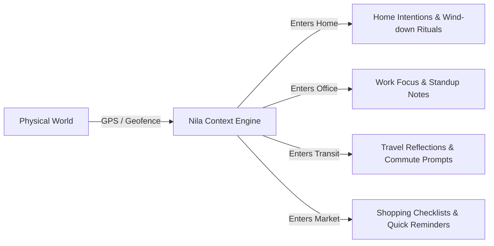

# Nila (நிலா) — Complete Product & Technical Documentation

> **"Holding space for your day, wherever you go."**  
> Nila is a privacy-first, location-aware mindful companion that connects your physical environment with your daily intentions. Instead of pressuring users with rigid deadlines and intrusive alarms, Nila uses **Sanctuaries**, **Mindful Rhythms**, and **Contextual Intelligence** to help you be present where your feet are.

🌸 **Looking for the client onboarding & user manual? [Read the Client & User Guide (USER_GUIDE.md)](./USER_GUIDE.md)**

---

## Table of Contents

1. [Executive Summary & Philosophy](#1-executive-summary--philosophy)
2. [The Core Pillars](#2-the-core-pillars)
3. [Deep Dive: Sanctuaries (Sacred Spaces)](#3-deep-dive-sanctuaries-sacred-spaces)
4. [Deep Dive: Mindful Rituals & Tasks (Intentions)](#4-deep-dive-mindful-rituals--tasks-intentions)
5. [Deep Dive: Daily Rhythm & Tabbed Dashboard](#5-deep-dive-daily-rhythm--tabbed-dashboard)
6. [Deep Dive: Journey & Transit](#6-deep-dive-journey--transit)
7. [Deep Dive: AI Quick Add (Nila AI)](#7-deep-dive-ai-quick-add-nila-ai)
8. [Deep Dive: Gentle Sound & Smart Alerts](#8-deep-dive-gentle-sound--smart-alerts)
9. [Deep Dive: Location Simulator (Demo Mode)](#9-deep-dive-location-simulator-demo-mode)
10. [Technical Architecture & Privacy](#10-technical-architecture--privacy)
11. [Client Pitch & Presentation Cheatsheet](#11-client-pitch--presentation-cheatsheet)
12. [Deployment & Configuration Guide](#12-deployment--configuration-guide)

---

## 1. Executive Summary & Philosophy

Traditional productivity systems operate on a flawed assumption: that life should be governed strictly by arbitrary clock times. Users are forced to set artificial deadlines (e.g. *"Clean kitchen at 3:00 PM"*), even when they are physically at an office meeting at 3:00 PM. This creates:
- **Notification fatigue**: Constant buzzing that is immediately dismissed.
- **Cognitive clutter**: Seeing 30+ mixed tasks from work, home, and personal life all at once.
- **Guilt & Burnout**: Feeling behind schedule when the calendar doesn't align with physical reality.

**Nila inverts this paradigm:**
- Tasks become **Intentions** tied to **Places (Sanctuaries)**.
- Reminders occur when you physically **enter** or **exit** a relevant space.
- Unrelated tasks automatically fade away, freeing your mind to focus only on where you currently are.



---

## 2. The Core Pillars

| Pillar | Principle | Real-World Impact |
|---|---|---|
| **Calm Tech** | Technology should inform and hold space, not demand your attention. | Soft pastel interfaces, no aggressive red badges, square clean lines, and soothing audio chimes. |
| **Context Over Clock** | The right reminder at the right physical location beats an arbitrary timer every time. | You get reminded to water your plants when you walk through your front door, not while you're driving. |
| **Cognitive Offloading** | Your brain is for having ideas, not for holding a cluttered mental inventory. | When leaving home, home tasks disappear so you can focus completely on work or rest. |
| **Zero-Knowledge Privacy** | Where you live, work, and travel is nobody's business but your own. | 100% of location data, tasks, notes, and credentials stay inside your browser's IndexedDB. |

---

## 3. Deep Dive: Sanctuaries (Sacred Spaces)

### What is a Sanctuary?
In Nila, a **Sanctuary** is any physical location that has personal meaning and context. Common sanctuaries include:
- 🏡 **Home**: Unwind rituals, plant care, reading, family time.
- 🏢 **Work / Studio**: Priority deliverables, meeting agendas, deep work rituals.
- ☕ **Favorite Café**: Writing, journaling, creative projects.
- 🏋️ **Gym / Park**: Movement, hydration, stretching intentions.
- 🛒 **Grocery Store / Market**: Shopping lists, household replenishment.

### Key Capabilities of Sanctuaries

#### 1. Geofencing & Event Triggers
Each Sanctuary defines a geographic center (latitude, longitude) and a radius (default: 100m – 300m). Nila listens to location coordinates and triggers contextual events:
- **`ENTER` (Arrival)**: Fired the moment the user steps inside the sanctuary perimeter.
- **`EXIT` (Departure)**: Fired when leaving the sanctuary (e.g., *"Did you remember your keys and water bottle?"*).
- **`NONE` (General / Ambient)**: For intentions that are associated with the place but don't require an immediate geofence alert.

#### 2. Space Customization
Users can customize every sanctuary with:
- **Sacred Emoji**: Visual identity (e.g. 🏡, 🌸, 🌿, ☕, 🏢).
- **Pastel Color Theme**: Custom hue used for badges, cards, and map markers.
- **Physical Address**: Street name, neighborhood, or landmark for easy identification.

#### 3. Place-Based Notes & Recurring Checklists
Inside each Sanctuary's detail view (`/places/[id]`), users have access to:
- **Sacred Notes**: Persistent space documentation (e.g., Wi-Fi passwords, gate codes, landlord notes, paint codes).
- **Checklists**: Reset-able recurring checklists (e.g. *"Leaving Home Checklist"*, *"Gym Bag Checklist"*). With one click, items can be checked off and reset for the next visit.

---

## 4. Deep Dive: Mindful Rituals & Tasks (Intentions)

### Why "Intentions" Instead of "Tasks"?
A "task" is an obligation; an "intention" is a mindful commitment. Nila structures intentions with gentle metadata:

```typescript
interface Task {
  id: string;
  title: string;              // e.g. "Water the lavender on balcony"
  description?: string;        // Extended context or reflections
  placeId?: string;           // Associated Sanctuary
  triggerType: "ENTER" | "EXIT" | "NONE";
  timeStart?: string;         // e.g. "07:00" (optional active window)
  timeEnd?: string;           // e.g. "12:00"
  priority: "low" | "medium" | "high";
  completed: boolean;
  dueDate?: string;
  dueTime?: string;
}
```

### Visual Priority Cues
- **High (`✦ High`)**: Soft rose pastel badge with sparkle icon for critical responsibilities.
- **Medium (`✦ Medium`)**: Warm peach/pink pastel badge for standard items.
- **Low (`✦ Low`)**: Calm stone-grey badge for gentle non-urgent wishes.

### Active Time Windows
An intention can be set to only trigger if the user arrives within a specific time bracket (e.g., *only alert me when I arrive at the Office between 08:30 AM and 10:00 AM*). Outside that window, the intention stays quiet.

---

## 5. Deep Dive: Daily Rhythm & Tabbed Dashboard

The Home screen (`/`) is designed around a single-focus, tabbed dashboard that adapts to your physical position and daily rhythm.

### Real-Time Clock & Dynamic Greetings
The top desktop navigation bar features a live 12-hour clock accompanied by warm, time-of-day greetings:

| Time Bracket | Greeting Message | Vibe & Purpose |
|---|---|---|
| **Morning (5 AM – 12 PM)** | `happy morning my love 💖` | Gentle start, awakening, encouraging morning flow. |
| **Afternoon (12 PM – 5 PM)** | `dont forget to eat dear ✨` | Midday nourishment, hydration, mindful break reminder. |
| **Evening (5 PM – 9 PM)** | `Warm Haven darling 🌇` | Golden hour transition, unwinding, returning to sanctuary. |
| **Night (9 PM – 5 AM)** | `Gentle Moonlight dear 🌙` | Restful serenity, screen dimming, peaceful slumber. |

### Interactive Tabbed View
To keep the screen calm and prevent visual overload, the dashboard features three tabs:
1. **🌸 Active Flow**:
   - Displays live status when at a sanctuary (with pulsating `Live` badge).
   - Shows all pending intentions specifically tied to your current space.
   - Quick "Explore Place Details" link.
2. **✨ Upcoming**:
   - Shows a global count of remaining intentions across all spaces.
   - Arranged in an organized responsive grid so cards never stretch awkwardly.
3. **🏡 Sanctuaries**:
   - Displays all saved spaces with live intention counts and quick management access.

---

## 6. Deep Dive: Journey & Transit

Travel time between sanctuaries is not "wasted time"—it is a liminal space for reflection and decompression.
- **The Journey View (`/journey`)**: Features an interactive Leaflet map with OpenStreetMap tiles.
- **Origin & Destination Selectors**: Allows selecting a starting sanctuary and destination to preview the transit corridor.
- **Transit Thoughts**: Space to record reflections or voice thoughts while traveling between home, work, and city spaces.

---

## 7. Deep Dive: AI Quick Add (Nila AI)

Located prominently below the greeting on the Home screen, the **AI Quick Add** bar allows natural language input:
- **Visual Design**: Sleek bar with a signature **curved crescent moon icon (`Moon` 🌙)** and an **`Add 🌙`** action button.
- **Smart Parsing**: Powered by Google Gemini (or OpenAI).
- **Example Inputs**:
  - *"Remind me to buy oat milk when I arrive at Supermarket"*
  - *"Water the orchids tomorrow morning at Home"*
  - *"Pick up dry cleaning on my way out of Work"*
- **Result**: Nila automatically identifies the title, matches the sanctuary name from your saved places, extracts the `ENTER`/`EXIT` trigger, and creates the intention instantly.

---

## 8. Deep Dive: Gentle Sound & Smart Alerts

When an arrival or departure event occurs, Nila avoids harsh buzzers or shrill alarms:
- **20-Second Ambient Chime**: Synthesized natively using the browser's **Web Audio API** (harmonic sine waves with gentle decay, no external audio files required).
- **Top Notification Banner (`TopAlertBanner`)**: Surfaces at the top of the viewport with actionable controls:
  - **Stop**: Permanently silences and acknowledges the alert for this arrival.
  - **Snooze**: Resurfaces the reminder in 5 minutes regardless of location.
  - **Hide (✕)**: Dismisses now; checks again in 5 minutes only if you are still at that sanctuary.
  - **Reschedule**: Opens an instant bottom sheet modal to adjust time, date, or sanctuary.

---

## 9. Deep Dive: Location Simulator (Demo Mode)

For testing, demonstrations, and client presentations, Nila includes a floating **Location Simulator** widget in the bottom-right corner:
- **Enable Simulator Switch**: Overrides the browser's hardware GPS.
- **Instant Teleportation**: Select any saved Sanctuary from a dropdown list to instantly simulate "arriving" there.
- **Trigger Verification**: Allows demonstrating `ENTER` and `EXIT` chimes, banner alerts, and active flow changes without having to physically walk outside.

---

## 10. Technical Architecture & Privacy

Nila is engineered as a **Local-First Web Application**:

```
+-------------------------------------------------------------+
|                        Browser Client                       |
|                                                             |
|  [Next.js 16 App Router] <---> [Zustand Global Store]       |
|            |                                |               |
|            v                                v               |
|  [Context Engine & Hooks] <--> [Dexie.js IndexedDB Storage] |
|            |                         |                      |
|            |                         +-> Places             |
|            |                         +-> Tasks & Rituals    |
|            |                         +-> Checklists & Notes |
|            |                         +-> Users (PBKDF2)     |
|            v                                                |
|  [Web Geolocation / Simulator]                              |
|  [Web Audio API (Ambient Chimes)]                           |
+-------------------------------------------------------------+
```

### Data Security & Privacy Guarantees
1. **Zero Server Telemetry**: Geolocation coordinates are processed strictly in local JavaScript memory. No server ever logs where you are.
2. **IndexedDB Local Storage**: All data is stored in your personal browser database using Dexie.js. If you clear browser data or reset, it remains solely on your device.
3. **Client-Side PBKDF2 Password Hashing**: Passwords are never sent across a network or stored in plain text. Hashing is performed using the browser's native **Web Crypto API**.

---

## 11. Client Pitch & Presentation Cheatsheet

Use these quick talking points when presenting Nila to stakeholders, clients, or new team members:

* **"Spaces, not just timers"**: Most reminders buzz at the wrong moment. Nila rings only when you are in the physical space to actually do something about it.
* **"Mental peace through context"**: When you leave the office, work tasks disappear. When you leave home, chores fade away. You get to be present wherever you are.
* **"Zero cloud tracking"**: Enterprise-grade privacy built-in by design. Location never leaves the user's pocket.
* **"Gentle cadence"**: Designed to reduce anxiety rather than increase pressure. Soft pastel color palettes, calming sound design, and supportive language throughout.

---

## 12. Deployment & Configuration Guide

### Deploying to Vercel (Recommended)
1. Push your repository to GitHub:
   ```bash
   git push origin master
   ```
2. Log into [Vercel](https://vercel.com) and click **"Add New..." → "Project"**.
3. Import the repository `vignesh-s-001/Nila`.
4. Add environment variables under **Project Settings**:
   - `NEXT_PUBLIC_AI_PROVIDER`: `gemini`
   - `NEXT_PUBLIC_AI_API_KEY`: *(Your Google Gemini or OpenAI API Key)*
5. Click **Deploy**. Vercel will complete the build and assign your live HTTPS domain.

---

*Made with 🌙 and care for mindful daily living.*
